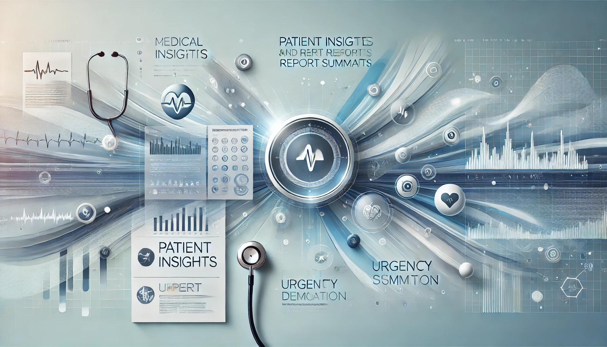
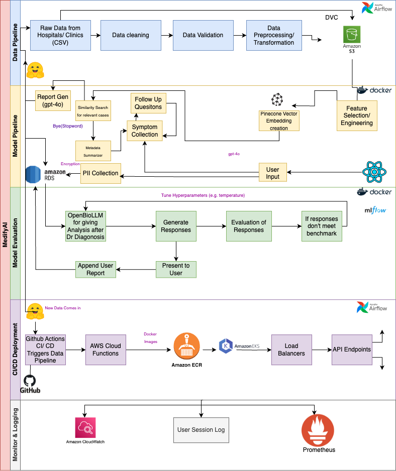

# Medify AI



# Medify AI: Medical Symptom Analysis System

Medify AI is a cloud-native healthcare system that combines conversational AI with sophisticated medical case analysis to provide comprehensive symptom analysis and treatment recommendations.

## System Architecture


The system operates in two main phases:
1. A specialized medical chatbot (HealthcarechatLLM) conducts structured symptom collection with real-time emergency detection
2. A Retrieval-Augmented Generation (RAG) model analyzes symptoms against historical cases for medical insights

## Cloud Infrastructure
- **Cloud Provider**: AWS
- **Core Services**:
  - Amazon EKS for Kubernetes orchestration
  - Amazon SageMaker for model serving
  - Amazon S3 for data storage
  - Pinecone for vector database
  - MLflow for experiment tracking

## Key Features
- Real-time emergency detection
- Bias detection and fairness monitoring
- Comprehensive MLflow experiment tracking
- Automated CI/CD pipeline with extensive testing
- Kubernetes-based deployment with auto-scaling

## Documentation
- [Cloud Deployment Architecture](docs/README.MD)
- [ML Pipeline Documentation](backend/ml_pipeline/README.md)
- [Data Pipeline Documentation](backend/data_pipeline/README.md)

## Video Demo
[Project Demo Video](https://drive.google.com/drive/folders/19H8RAABVZ1dCw0p4YTw2ry5hKUAxjPj8?usp=sharing)

## Deployment
The system is deployed on AWS EKS with:
- Frontend Service: `k8s-default-frontend-83b9bf328b-4645da8feaa0ec6e.elb.us-east-2.amazonaws.com`
- Backend Service: `k8s-default-backends-848a823787-ea2281742964f835.elb.us-east-2.amazonaws.com`
- MLflow Dashboard: `http://k8s-default-backends-848a823787-ea2281742964f835.elb.us-east-2.amazonaws.com:8050`

## Monitoring
- Prometheus metrics collection
- Grafana dashboards for visualization
- CloudWatch for centralized logging
- Automated email alerts for system events

## Testing
Comprehensive testing framework including:
- Unit tests for individual components
- Integration tests for system coherence
- Bias detection tests for fairness
- Retrieval validation for accuracy


## Installation

To use PatientInsight, follow these steps:

1. Clone the repository:
   ```bash
   git clone https://github.com/your-username/patient-insight.git
   cd patient-insight
   ```

2. Create a virtual environment and activate it:
   ```bash
   python -m venv venv
   source venv/bin/activate  # On Windows, use `venv\Scripts\activate`
   ```

3. Install the required packages:
   ```bash
   pip install -r requirements.txt
   ```

4. Set up Airflow:
   ```bash
   export AIRFLOW_HOME=$(pwd)/airflow
   airflow db init
   airflow users create --username admin --password admin --firstname Admin --lastname User --role Admin --email admin@example.com
   ```

5. Start the Airflow webserver and scheduler:
   ```bash
   airflow webserver --port 8080
   airflow scheduler
   ```

6. Access the Airflow web interface at `http://k8s-default-backends-848a823787-ea2281742964f835.elb.us-east-2.amazonaws.com:8080` and enable the `patient_insight_pipeline` DAG.

7. Run the application:
   ```bash
   streamlit run app.py
   ```

## Usage

Once the application is running, simply upload your medical report or prescription document. The tool will automatically analyze the content and provide actionable insights in a user-friendly format.

## Data Pipeline

The data pipeline is orchestrated using Apache Airflow. Once the DAG is enabled, it will run automatically according to the schedule defined in the DAG file.

To run the pipeline manually:

1. Go to the Airflow web interface.
2. Navigate to the `patient_insight_pipeline` DAG.
3. Click on the "Trigger DAG" button.

## Project Structure

- `data/`: Contains raw and processed data files.
- `sripts_location/`: Source code for data processing and analysis.
- `tests/`: Unit tests for the project.
- `airflow/`: Airflow DAG definitions.
- `notebooks/`: Jupyter notebooks for exploratory analysis.

## Dataset

This tool leverages insights derived from the [PMC-Patients](https://huggingface.co/datasets/zhengyun21/PMC-Patients) dataset. The dataset includes patient summaries and relationships extracted from case reports, aiding in identifying patterns across medical reports and offering enhanced decision support for doctors.

## Data Versioning

This project uses DVC (Data Version Control) to manage and version the dataset. To get the latest version of the data, run:

```bash
dvc pull
```

## Contributing

Contributions are welcome! Please read our [contributing guide](CONTRIBUTING.md) to get started.

### Collaborators

- **Amitesh Tripathi** - [tripathi.am@northeastern.edu]
- **Rohit Kumar Gaddam** - [gaddamsreeramulu.r@northeastern.edu]
- **Deepak Udayakumar** - [udayakumar.de@northeastern.edu]
- **Dinesh Sai Pappuru** - [pappuru.d@northeastern.edu]
- **Sneha Amin** - [amin.sn@northeastern.edu]

## License

This project is licensed under the MIT License - see the [LICENSE](LICENSE) file for details.
